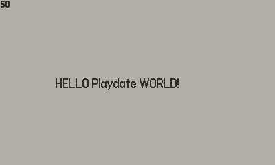

# Simple Template for C_API




## rake tasks

```
rake build                       # Build all
rake build:device:debug          # Build (device, debug)
rake build:device:release        # Build (device, release)
rake build:simulator:debug       # Build (simulator, debug)
rake build:simulator:release     # Build (simulator, release)
rake clean                       # Remove any temporary products
rake clobber                     # Remove any generated files
rake generate:device:debug       # Generate Makefile (device, debug)
rake generate:device:release     # Generate Makefile (device, release)
rake generate:simulator:debug    # Generate Makefile (simulator, debug)
rake generate:simulator:release  # Generate Makefile (simulator, release)
rake generate:xcode              # Generate Xcode project (xcode)
rake run                         # Run on Simulator
rake test                        # Test
```


## configure

- Please specify your game name.
    - https://github.com/fum1h1ro/PlaydateCTemplate/blob/master/Rakefile#L3
    - https://github.com/fum1h1ro/PlaydateCTemplate/blob/master/Source/pdxinfo


## usage

1. delete working directory
    - `rake clean`
    - `rake clobber` # delete pdx
2. generate Makefile for Playdate Simulator
    - `rake generate:simulator:debug`
    - `rake generate:simulator:release`
3. build
    - `rake build:simulator:debug`
    - `rake build:simulator:release`
4. `rake run`
5. `rake test`
    - depends on `generate:simulator:debug`
6. generate Makefile for Playdate
    - `rake generate:device:debug`
    - `rake generate:device:release`
7. build
    -`rake build:device:debug`
    -`rake build:device:release`

